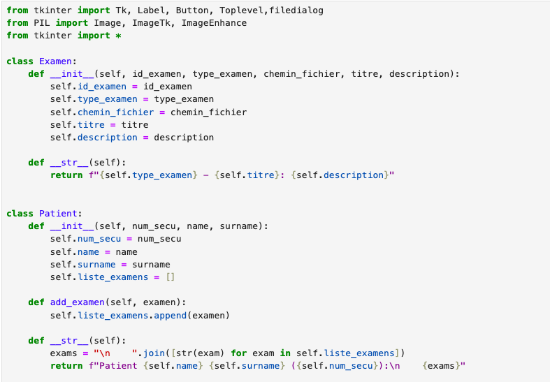

# MAM2ADMM-Series00-Git-VotreIDGitHub
# Introduction

Ce repository me sert à apprendre les fondamentaux de Git et GitHub en pratiquant concrètement. Mon expérience avec ces outils est encore limitée, mais je suis motivé à les maîtriser pour mieux organiser mes projets de code. J'ai hâte de découvrir toutes les possibilités qu'offrent Git et GitHub pour le travail collaboratif et la gestion de versions.

## Une image

## Ma motivation

Je souhaite apprendre Python, R et Git car ces outils sont essentiels dans le domaine de l'analyse de données et du développement moderne. Python me permettra d'automatiser des tâches et de créer des applications performantes, tandis que R m'aidera à analyser et visualiser des données complexes. Git est indispensable pour gérer mes projets de manière professionnelle et collaborer efficacement avec d'autres développeurs. Maîtriser ces trois technologies ouvrira de nombreuses opportunités dans ma carrière et me rendra plus autonome dans mes projets. Je suis déterminé à progresser rapidement et à appliquer ces compétences dans des projets concrets.

## Mon image locale

